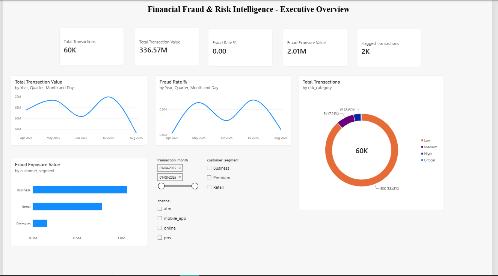
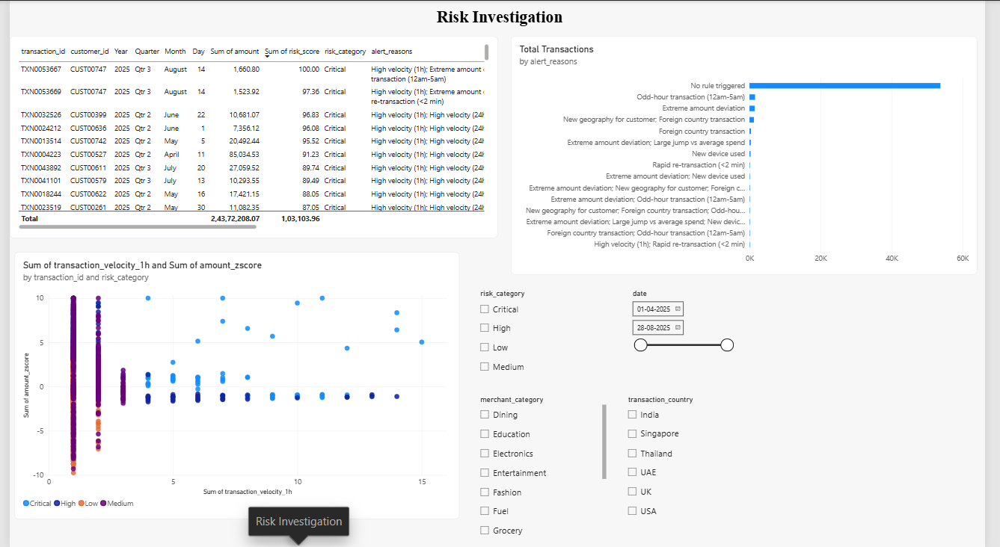
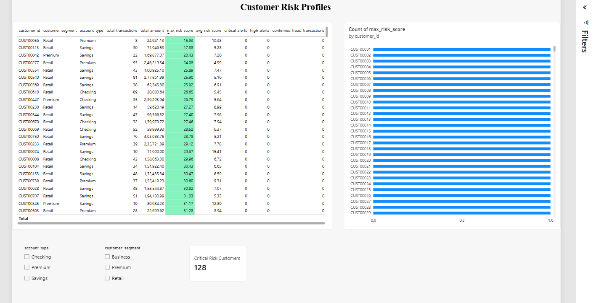
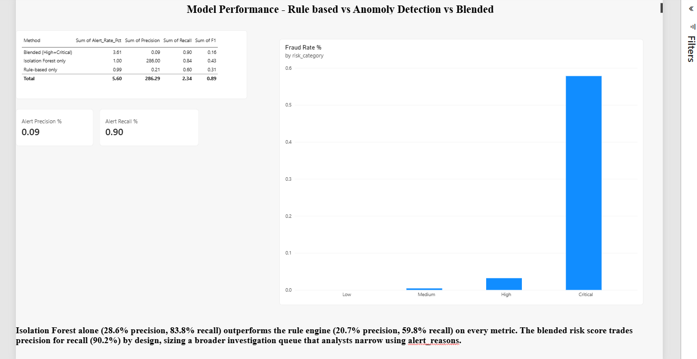

# Financial Fraud & Risk Intelligence Analytics

An end-to-end data analytics project that detects and investigates suspicious
financial transactions using SQL, Python (pandas, scikit-learn), and a Power
BI investigation dashboard. Built as a portfolio-ready project for Data
Analyst / Risk Analyst roles — fully reproducible, zero-cost, and using only
synthetic data (safe for public GitHub).

## 1. Business problem

Financial institutions lose money to fraud they can't distinguish from
legitimate activity fast enough. A risk team needs to:

1. Score every transaction for fraud risk using both known heuristics
   (rules) and pattern-based anomaly detection.
2. Understand *why* a transaction was flagged (explainable alert reasons),
   not just a black-box score.
3. Prioritize investigation effort — a fixed team can only review a limited
   number of alerts per day, so alerts need to be ranked, not just binary.
4. Monitor fraud exposure and trends across customer segments, channels, and
   geography.

This project builds that pipeline end to end: raw transactions → cleaned data
→ engineered behavioral features → rule-based flags → an unsupervised
anomaly-detection model → a blended risk score with four risk tiers → a Power
BI dashboard for investigators.

## 2. Dataset

The dataset is **fully synthetic**, generated by `python/01_data_generation.py`
with a fixed random seed (reproducible). No real customer or transaction data
is used anywhere in this project.

- **800 customers**: age, gender, home city/country, account type, customer
  segment (Retail / Premium / Business), signup date.
- **~59,700 transactions** over a 5-month period: amount, merchant category,
  channel (online / POS / ATM / mobile app), transaction city/country, device
  ID, timestamp.
- **204 fraud transactions (~0.34%)** injected using four realistic fraud
  patterns: velocity attacks (rapid transaction bursts), card testing (many
  small transactions followed by one large one), geographic anomalies
  (transactions from a country/city the customer has never used), and amount
  spikes (a transaction far above the customer's normal spend).

A `is_fraud_synthetic` ground-truth label is included **only to evaluate**
the rule-based and anomaly-detection methods afterward — it is never used as
an input feature to either detection method, which is what makes the
evaluation meaningful.

## 3. Architecture / workflow

```
Raw Data Generation (Python)
        │
        ▼
Data Cleaning & Quality Checks (Python)
        │
        ▼
Feature Engineering: velocity, amount deviation, geography, device (Python)
        │
        ├──► Rule-Based Detection (Python)
        │
        └──► Isolation Forest Anomaly Detection (Python, scikit-learn)
        │
        ▼
Blended Risk Score + Risk Category (Python)
        │
        ├──► Statistical Validation: t-test, chi-square, confidence interval (Python, SciPy)
        │
        ├──► SQL Analytics Database (SQLite): KPIs, cohort analysis, window functions
        │
        └──► Power BI-Ready Export → Investigation Dashboard (Power BI Desktop)
```

## 4. Project structure

```
fraud-risk-analytics/
├── README.md
├── requirements.txt
├── .gitignore
├── run_pipeline.py                  # Runs the entire pipeline in order
├── data/
│   ├── raw/
│   │   ├── customers.csv
│   │   └── transactions.csv
│   └── processed/
│       ├── customers_clean.csv
│       ├── powerbi_transactions.csv       # Main Power BI fact table
│       ├── powerbi_customer_summary.csv   # Power BI customer dimension
│       └── powerbi_date_dimension.csv     # Power BI date dimension
│       (transactions_clean.csv, transactions_features.csv,
│        transactions_rules.csv, transactions_anomaly.csv, risk_scores.csv
│        are intermediate checkpoints regenerated by run_pipeline.py —
│        see data/processed/README.md)
├── python/
│   ├── 00_build_database.py
│   ├── 01_data_generation.py
│   ├── 02_data_cleaning.py
│   ├── 03_feature_engineering.py
│   ├── 04_rule_based_detection.py
│   ├── 05_anomaly_detection.py
│   ├── 06_statistical_analysis.py
│   ├── 07_generate_visuals.py
│   └── 08_export_powerbi.py
├── sql/
│   ├── 01_schema.sql
│   ├── 02_data_quality_checks.sql
│   ├── 03_kpi_queries.sql
│   ├── 04_fraud_risk_analysis.sql
│   └── 05_cohort_segmentation.sql
├── powerbi/
│   ├── DASHBOARD_GUIDE.md            # Step-by-step Power BI build guide
│   └── dax_measures.txt              # All DAX measures, ready to paste
└── outputs/
    ├── figures/                      # 6 PNG charts from the analysis
    └── reports/
        └── statistical_summary.txt   # t-test, chi-square, CI, correlations
```

## 5. Setup

Requires Python 3.10+ (any recent Python 3 works). No paid services, no API
keys, no Docker requirement — everything runs locally for free.

```bash
python3 -m venv venv
source venv/bin/activate        # Windows: venv\Scripts\activate
pip install -r requirements.txt
```

## 6. Running the project

Run the entire pipeline in one command:

```bash
python run_pipeline.py
```

This runs all nine steps in order (data generation through database build)
and regenerates every file under `data/processed/`, `outputs/`, and
`data/fraud_analytics.db`. It takes under a minute on a typical laptop.

To run stages individually instead:

```bash
cd python
python 01_data_generation.py       # synthetic customers + transactions
python 02_data_cleaning.py         # validation, dedup, null/negative checks
python 03_feature_engineering.py   # velocity, amount z-score, geography, device features
python 04_rule_based_detection.py  # 9-rule heuristic engine
python 05_anomaly_detection.py     # Isolation Forest (unsupervised)
python 06_statistical_analysis.py  # blended risk score, t-test, chi-square, CI
python 07_generate_visuals.py      # 6 charts to outputs/figures/
python 08_export_powerbi.py        # flat Power BI-ready CSVs
python 00_build_database.py        # builds data/fraud_analytics.db
```

## 7. SQL analysis

The pipeline builds a local SQLite database (`data/fraud_analytics.db`) with
three tables: `customers`, `transactions` (raw), and
`risk_scored_transactions` (the final scored dataset). SQLite was chosen
because it needs no server and no cost — the schema in `sql/01_schema.sql`
is standard SQL and can be pointed at PostgreSQL/MySQL with minor syntax
changes if you'd rather use a client-server database.

Run any query file with the `sqlite3` command-line tool:

```bash
sqlite3 data/fraud_analytics.db < sql/02_data_quality_checks.sql
sqlite3 data/fraud_analytics.db < sql/03_kpi_queries.sql
sqlite3 data/fraud_analytics.db < sql/04_fraud_risk_analysis.sql
sqlite3 data/fraud_analytics.db < sql/05_cohort_segmentation.sql
```

Or open `data/fraud_analytics.db` in a free GUI like
[DB Browser for SQLite](https://sqlitebrowser.org/).

What each file covers:
- **02_data_quality_checks.sql** — duplicate IDs, orphan records, null
  checks, non-positive amounts, row-count reconciliation.
- **03_kpi_queries.sql** — headline KPIs, risk category breakdown, fraud
  exposure by segment/channel, monthly trend, top alert reasons, riskiest
  customers.
- **04_fraud_risk_analysis.sql** — window functions (`LAG`, `RANK`, moving
  average frames) reproducing velocity and deviation logic directly in SQL,
  geography risk, rule co-occurrence, and a cross-check of the three
  detection methods' precision/recall.
- **05_cohort_segmentation.sql** — signup-month cohorts vs fraud rate,
  spend-quartile segmentation (`NTILE`), age-band risk mix, account type,
  weekday patterns.

## 8. Python analysis

- **Feature engineering** (`03_feature_engineering.py`): transaction
  velocity (1h/24h rolling counts), amount z-score against each customer's
  own expanding historical average (no look-ahead leakage — only past
  transactions are used), new-city/new-device/new-category flags, odd-hour
  and foreign-transaction flags.
- **Rule-based detection** (`04_rule_based_detection.py`): 9 weighted rules
  (high velocity, extreme amount deviation, new device, new geography,
  foreign transaction, odd hour, rapid re-transaction, etc.) producing a
  0-100 rule score and a human-readable alert reason list.
- **Anomaly detection** (`05_anomaly_detection.py`): an Isolation Forest
  (scikit-learn), trained only on behavioral features (never on the fraud
  label), with a 1% contamination assumption matching realistic fraud
  prevalence.
- **Statistical analysis** (`06_statistical_analysis.py`): blends the two
  scores into a final `risk_score`, assigns four risk tiers using fixed
  thresholds selected via a precision/recall/F1 sweep against the ground
  truth, then runs a Welch's t-test, a chi-square test, and a 95% confidence
  interval (see Key Findings below).

## 9. Key performance indicators

Computed live from the pipeline output (`outputs/reports/statistical_summary.txt`):

| Metric | Value |
|---|---|
| Total transactions | 59,680 |
| Total transaction value | ₹336.6M |
| Confirmed fraud transactions | 204 (0.342%) |
| Fraud exposure value | ₹2.01M |
| Transactions in Critical risk tier | 211 (0.35% of volume, 57.8% of it is confirmed fraud) |
| Transactions in High risk tier | 1,945 (3.26% of volume, 3.2% of it is confirmed fraud) |

## 10. Statistical & ML methods, and results

**Model comparison** (evaluated against the synthetic ground truth, which is
never used as a model input):

| Method | Alert rate | Precision | Recall | F1 |
|---|---|---|---|---|
| Rule-based only | 0.99% | 0.207 | 0.598 | 0.308 |
| Isolation Forest only | 1.00% | 0.286 | 0.838 | 0.427 |
| Blended risk score (High + Critical tiers) | 3.61% | 0.085 | 0.902 | 0.156 |

The unsupervised anomaly model alone outperforms the rule engine on every
metric — a realistic and discussable finding, since the rules only encode
patterns an analyst already thought to write down, while Isolation Forest
finds combinations of unusual behavior nobody specified in advance. The
blended score is intentionally more permissive (recall-oriented): risk
categories are meant to size an *investigation queue*, not to be a final
verdict, so the "High + Critical" tier is designed to catch 90% of fraud at
the cost of a lower precision, which a human analyst then narrows down using
the `alert_reasons` field.

**Welch's t-test** on transaction amount, fraud vs non-fraud: fraud
transactions average ₹9,862.84 vs ₹5,625.12 for non-fraud (t = 3.13,
p = 0.00198) — a statistically significant difference at α = 0.05.

**Chi-square test** of independence between risk category and transaction
channel: χ² = 65.29, p < 0.0001 — risk category is not independent of
channel, i.e., certain channels carry disproportionately more high-risk
transactions.

**95% confidence interval** on the overall fraud rate: 0.295% – 0.389%
(n = 59,680).

**Feature correlation with the final risk score** (strongest to weakest):
anomaly_score (0.97), rule_score (0.85), is_foreign_transaction (0.54),
is_new_city_for_customer (0.53), amount_ratio_to_avg (0.45),
amount_zscore (0.44), is_odd_hour (0.36).

## 11. Power BI dashboard

Full build instructions, table relationships, and every DAX measure are in
[`powerbi/DASHBOARD_GUIDE.md`](powerbi/DASHBOARD_GUIDE.md). In short: import
the three CSVs from `data/processed/`, relate them on `customer_id` and
`transaction_date`, paste in the measures from `powerbi/dax_measures.txt`,
and build four pages — Executive Overview, Risk Investigation (drill-down),
Customer Risk Profiles, and Model Performance. The guide includes exact chart
types, fields, and slicers for each page.

## 11a. Dashboard screenshots






The full interactive `.pbix` file is at `powerbi/fraud_risk_dashboard.pbix` —
open it in Power BI Desktop (free) to explore the slicers and drill-downs
yourself.

## 12. Reproducing this project from an empty machine

```bash
git clone <your-repo-url>
cd fraud-risk-analytics
python3 -m venv venv
source venv/bin/activate
pip install -r requirements.txt
python run_pipeline.py
```

That single command regenerates the raw data, cleans it, engineers features,
runs both detection methods, computes statistics, generates charts, exports
the Power BI CSVs, and builds the SQLite database — identically every time,
because the random seed is fixed. Then follow
`powerbi/DASHBOARD_GUIDE.md` to build the dashboard in Power BI Desktop
(free download from Microsoft).

## 13. Limitations and assumptions

- The dataset is synthetic. Fraud patterns are deliberately injected to be
  *learnable*, so precision/recall numbers here demonstrate the methodology
  working correctly — they are not a claim about performance on real-world
  data, which would need a live feedback loop, richer features (e.g. IP/
  device fingerprinting, network graphs), and a proper train/validation/test
  split over time.
- The risk-tier thresholds (`Medium ≥ 20, High ≥ 40, Critical ≥ 60`) were
  selected via a threshold sweep against the synthetic labels; in a real
  deployment they should be re-tuned periodically against live outcomes and
  investigator capacity.
- Isolation Forest's `contamination` parameter (1%) is a modeling
  assumption, not a measured fraud rate; it was chosen to reflect a
  realistic industry fraud-alert volume rather than the exact 0.34% ground
  truth (which a real system wouldn't know in advance).
- All monetary figures are in INR (₹) and are synthetic.
- No personally identifiable, proprietary, or licensed data is used
  anywhere in this project.
